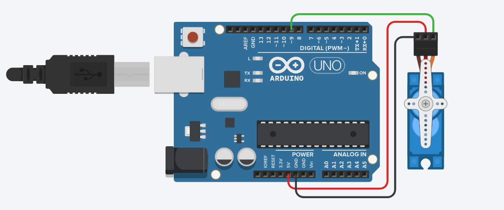

# MouseJiggler
# Servo Motor Mouse Movement Simulator

This project is designed to prevent idle timeouts by using a servo motor to move a small platform or floor under a computer mouse. The movement simulates natural user activity, keeping the system active during long periods of inactivity.

---

## Features
- **Random Movement Simulation**: Introduces random delays in the servo movement to mimic natural, human-like mouse activity.
- **Customizable Behavior**: The movement range, speed, and randomness can be adjusted to suit specific needs.
- **Idle Timeout Prevention**: Ensures the system remains active without requiring manual interaction.

---

## Hardware Requirements
1. **Arduino Board**: Any Arduino board compatible with the Servo library (e.g., Uno, Mega).
2. **Servo Motor**: A standard servo motor (e.g., SG90 or equivalent) to provide the movement.
3. **Platform or Movable Floor**: A small surface attached to the servo motor for the mouse to rest on.
4. **USB Cable**: For connecting the Arduino to your computer.
5. **Power Source**: External power for the servo motor (if required).

---

## Circuit Setup

### Schematic

### Connections
1. **Servo Motor**:
   - **Signal Pin (Orange/White)**: Connect to Arduino digital pin 9.
   - **Power Pin (Red)**: Connect to Arduino 5V.
   - **Ground Pin (Brown/Black)**: Connect to Arduino GND.
2. **Power**:
   - Use the Arduino's USB connection to power the system or an external power source for additional servo motor stability.

### Assembly
1. Attach the servo motor securely to the platform or floor that will move the mouse.
2. Ensure stable connections as shown in the schematic.

---

## How It Works
1. **Servo Motor Control**:
   - A servo motor is connected to the Arduino board and moves back and forth in a sweeping motion.
   - The servo is attached to a small platform or movable floor where the mouse rests.

2. **Randomized Delays**:
   - The project uses the Arduino's `random()` function to introduce variability in the speed and timing of the servo's movements, ensuring that the mouse activity does not appear mechanical or repetitive.

3. **Preventing Idle Timeout**:
   - The small movements of the platform shift the mouse slightly, simulating user interaction and preventing the system from entering idle mode.

---

## Setup Instructions

1. **Connect the Servo Motor**:
   - Attach the servo motor to the Arduino as per the schematic.
   - Secure the platform or movable floor to the servo arm.

2. **Upload the Code**:
   - Use the Arduino IDE to upload the provided sketch (code file) to the Arduino.
   - Ensure the correct board and port are selected in the IDE.

3. **Start the Project**:
   - Place your mouse on the movable platform.
   - Power on the Arduino to begin simulating mouse activity.

---

## Customization Options

1. **Movement Range**:
   - Adjust the servo's range of motion to accommodate the mouse's sensitivity or the size of the platform.

2. **Delays and Speed**:
   - Modify the randomness of the delays between movements to better suit your system's idle timeout behavior.

3. **Platform Design**:
   - Ensure the platform is stable and matches the size of your mouse for consistent movement.

---

## Notes
- **Testing**: Use on a secondary system initially to ensure compatibility with your hardware and software.
- **System Compliance**: Ensure that using this project aligns with your workplace or system policies.
- **Safety**: Unplug the Arduino when not in use to avoid unnecessary wear on the servo motor.

---

## Applications
- Prevent idle timeouts during long-running tasks such as downloads, simulations, or presentations.
- Maintain activity on systems with strict idle timeout settings.

---

## Acknowledgements
This project was inspired by the need for an automated solution to prevent idle timeouts during periods of extended inactivity.
